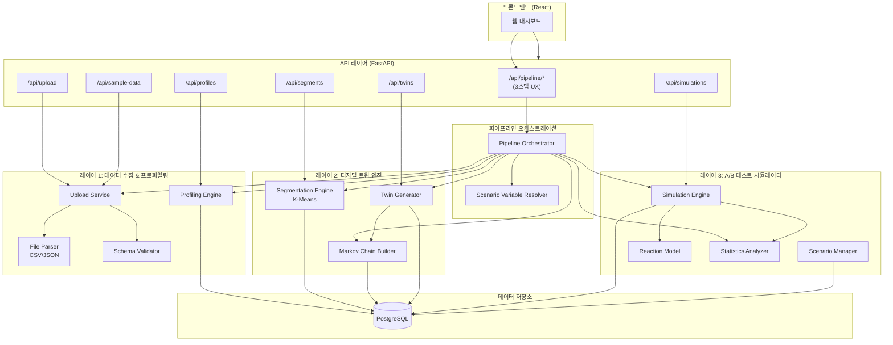
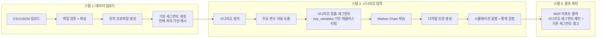

# 기술 설계: 디지털 트윈 기반 A/B 테스트 시뮬레이션 서비스

## Overview

본 서비스는 실제 사용자 행동 데이터(Event Log)를 기반으로 디지털 트윈(가상 유저)을 생성하고, 이를 활용하여 A/B 테스트를 시뮬레이션하는 MVP 시스템이다.

### MVP 사용자 경험: 3스텝 플로우

사용자는 "데이터 올리고 → 시나리오 적고 → 결과 보기" 3스텝으로 서비스를 이용한다:

```
1. 데이터 업로드 (CSV/JSON)
     ↓ 자동: 파싱 + 프로파일링 + 기본 세그먼트 생성 (캐시)
2. 시나리오 입력 (무엇을 테스트할 것인가)
     ↓ 자동: 주요 변수 도출 → 시나리오 맞춤 세그먼트 생성 → Markov Chain 학습 → 트윈 생성 → 시뮬레이션 + 통계 검정
3. 결과 리포트 출력
```

핵심 가치는 **세그먼트별 차별 반응 분석**으로, 단순 전체 전환율 비교를 넘어 유저 그룹별로 어떤 variant가 더 효과적인지를 사전에 파악할 수 있게 한다.

### 하이브리드 세그먼트 전략

- **기본 세그먼트**: 데이터 업로드 시 전체 피처로 자동 생성 (캐시, 폴백, 비교용)
- **시나리오 세그먼트**: 시나리오 입력 시 주요 변수만으로 동적 생성 (메인 시뮬레이션용)
- **리포트**: 시나리오 세그먼트 결과(메인) + 기본 세그먼트 결과(참고용) 모두 포함

### 분석 태그 및 가중 전환율

**분석 태그(Analysis Dimensions)** 기능을 통해 기본 K-Means 세그먼테이션 외에 시나리오별로 다양한 분석 관점(device, conversion_rate_tier, price_sensitivity_tier 등)을 태깅하여 결과를 재그룹핑할 수 있다. 각 분석 태그에는 **분류 조건(classification rules)**을 정의할 수 있어, 연속형 속성을 범주형으로 변환하거나(예: price_sensitivity 0.7 이상 → "high") 이산형 속성을 그대로 사용할 수 있다. 전체 전환율은 **세그먼트 비율 기반 가중 평균**으로 계산하여 세그먼트 크기 불균형에도 정확한 지표를 제공한다.

시스템은 3개 레이어 + 파이프라인 오케스트레이션으로 구성된다:

1. **데이터 수집 & 프로파일링 레이어** — CSV/JSON 파일 업로드, 검증, 파싱, 유저 프로파일 자동 생성
2. **디지털 트윈 엔진 레이어** — K-Means 세그먼테이션, Markov Chain 행동 모델 학습, 디지털 트윈 인스턴스 생성
3. **A/B 테스트 시뮬레이터 레이어** — 시나리오 정의, 시뮬레이션 실행, 통계 검정, 결과 시각화
4. **파이프라인 오케스트레이션 레이어** — 위 3개 레이어를 자동으로 연결하여 3스텝 UX를 제공

### 기술 스택

| 영역 | 기술 |
|------|------|
| Backend API | Python 3.11+, FastAPI |
| 데이터 처리 | NumPy, Pandas |
| 통계/ML | SciPy, scikit-learn |
| 데이터베이스 | PostgreSQL 15+ |
| Frontend | React 18+, Recharts (차트) |
| 테스트 | pytest, Hypothesis (PBT) |

### 설계 결정 근거

- **Markov Chain 선택 이유**: 페이지 간 전이 확률을 직관적으로 모델링할 수 있고, 학습 데이터가 적어도 동작하며, 해석 가능성이 높다. 딥러닝 기반 모델 대비 MVP에 적합한 복잡도를 가진다.
- **K-Means 선택 이유**: 구현이 단순하고, scikit-learn의 Silhouette Score 기반 자동 k 결정이 잘 지원된다. MVP 단계에서 충분한 세그먼테이션 품질을 제공한다.
- **규칙 기반 반응 모델 선택 이유**: ML 기반 반응 예측 대비 해석 가능성이 높고, 사용자가 직접 규칙을 정의/수정할 수 있어 도메인 전문가의 지식을 반영하기 용이하다.
- **카이제곱 검정 선택 이유**: 전환율(이진 결과)에 대한 비교에 가장 표준적인 검정 방법이며, SciPy의 `chi2_contingency`로 간단히 구현 가능하다.

## Architecture

### 시스템 아키텍처



### 3스텝 파이프라인 플로우



### 레이어 간 의존성

- 레이어 1 → 레이어 2: `User_Profile` 데이터를 통해 연결
- 레이어 2 → 레이어 3: `Digital_Twin` 인스턴스와 `Markov_Chain_Model`을 통해 연결
- 각 레이어는 PostgreSQL을 통해 데이터를 공유하며, 직접적인 코드 의존성은 최소화


## Components and Interfaces

### 1. Upload Service

파일 업로드, 검증, 파싱, 샘플 데이터 생성을 담당한다.

```python
class UploadService:
    async def upload_file(file: UploadFile) -> UploadResult:
        """CSV/JSON 파일을 업로드하고 검증 후 파싱한다."""

    def validate_file(file_content: bytes, filename: str) -> ValidationResult:
        """파일 크기, 형식, 필수 필드를 검증한다."""

    def parse_csv(content: str) -> list[EventRecord]:
        """CSV 내용을 EventRecord 리스트로 파싱한다."""

    def parse_json(content: str) -> list[EventRecord]:
        """JSON 내용을 EventRecord 리스트로 파싱한다."""

    def serialize_to_csv(records: list[EventRecord]) -> str:
        """EventRecord 리스트를 CSV 문자열로 직렬화한다."""

    def serialize_to_json(records: list[EventRecord]) -> str:
        """EventRecord 리스트를 JSON 문자열로 직렬화한다."""

    def generate_sample_data(user_count: int, days: int) -> list[EventRecord]:
        """무신사 패션 이커머스를 가정한 현실적인 샘플 이벤트 로그를 생성한다.
        페이지: /home, /category/men, /category/women, /category/shoes,
               /product/{id}, /cart, /checkout, /order-complete
        이벤트: page_view, click, scroll, purchase, add_to_cart, wishlist, coupon_apply
        유저 유형: 가격 민감형, 브랜드 충성형, 탐색형, 충동 구매형"""
```

### 2. Profiling Engine

이벤트 로그를 분석하여 유저 프로파일을 자동 생성한다.

```python
class ProfilingEngine:
    def generate_profiles(events: list[EventRecord]) -> list[UserProfile]:
        """이벤트 로그로부터 유저별 프로파일을 생성한다."""

    def compute_demographics(user_events: list[EventRecord]) -> Demographics:
        """device, os, locale 정보를 집계한다."""

    def compute_behavior(user_events: list[EventRecord]) -> BehaviorMetrics:
        """세션 지속시간, 페이지수, 전환율, 이탈률을 계산한다."""

    def compute_preferences(user_events: list[EventRecord]) -> Preferences:
        """top_pages, top_categories, price_sensitivity를 분석한다."""

    def extract_journey_patterns(user_events: list[EventRecord]) -> list[JourneyPattern]:
        """세션별 페이지 이동 경로를 패턴별 빈도로 집계한다."""
```

### 3. Segmentation Engine

유저 프로파일을 K-Means로 클러스터링한다. 기본 세그먼트(전체 피처)와 시나리오 전용 세그먼트(주요 변수만)를 모두 지원한다.

```python
class SegmentationEngine:
    def cluster_profiles(profiles: list[UserProfile]) -> list[Segment]:
        """K-Means 클러스터링으로 기본 세그먼트를 생성한다."""

    def recluster_for_scenario(
        profiles: list[UserProfile],
        key_variables: list[str],
        scenario_id: str
    ) -> list[Segment]:
        """시나리오의 주요 행동 변수만을 피처로 사용하여 K-Means 재클러스터링을 수행한다.
        기본 세그먼트와 별도로 시나리오 전용 Scenario_Segment를 생성한다.
        각 Scenario_Segment에 사용된 key_variables, 구성원 수, 해당 변수 평균값을 포함한다."""

    def build_feature_matrix(
        profiles: list[UserProfile],
        selected_variables: list[str] | None = None
    ) -> np.ndarray:
        """프로파일의 behavior/demographics를 수치 벡터로 변환한다.
        selected_variables가 지정되면 해당 변수만 피처로 사용한다."""

    def find_optimal_k(feature_matrix: np.ndarray) -> int:
        """Silhouette Score 기반으로 최적 클러스터 수를 결정한다. (2~10)"""

    def generate_segment_summary(segment: Segment) -> SegmentSummary:
        """세그먼트 요약 정보를 생성한다."""
```

### 4. Twin Engine (Markov Chain Builder + Twin Generator)

Markov Chain 모델을 학습하고 디지털 트윈을 생성한다.

```python
class MarkovChainBuilder:
    def build_model(segment_events: list[EventRecord]) -> MarkovChainModel:
        """세그먼트의 이벤트 로그로부터 전이 확률 행렬을 학습한다."""

    def normalize_transitions(matrix: dict[str, dict[str, float]]) -> dict[str, dict[str, float]]:
        """각 상태의 전이 확률 합이 1.0이 되도록 정규화한다."""

    def get_default_model(all_events: list[EventRecord]) -> MarkovChainModel:
        """전체 데이터 기반 기본 전이 확률 모델을 생성한다."""


class TwinGenerator:
    def generate_twins(
        count: int,
        segments: list[Segment],
        models: dict[str, MarkovChainModel]
    ) -> list[DigitalTwin]:
        """세그먼트 비율에 따라 디지털 트윈을 분배 생성한다."""

    def assign_demographics(segment: Segment) -> Demographics:
        """세그먼트 분포에 따라 demographics를 확률적으로 할당한다."""
```

### 5. Simulation Engine

A/B 테스트 시뮬레이션을 실행한다.

**가중 전환율 계산 메커니즘**: 전체 전환율은 단순 평균이 아닌, 세그먼트 비율 기반 가중 평균으로 계산한다.

```
전체 전환율 = Σ (세그먼트 비율 × 세그먼트별 전환율)
```

여기서 세그먼트 비율 = 해당 세그먼트의 트윈 수 / 전체 트윈 수이다. 이를 통해 세그먼트 크기가 불균등한 경우에도 정확한 전체 전환율을 산출한다.

**분석 태그 기반 재그룹핑**: 시나리오에 `analysis_tags`가 지정된 경우, 시뮬레이션 완료 후 각 태그 기준으로 디지털 트윈을 재그룹핑하여 태그별 전환율 비교 결과를 추가 산출한다. 기본 K-Means 세그먼테이션은 한 번만 수행하며, 분석 태그는 결과 조회 시 트윈의 demographics/behavior 속성을 기준으로 동적 그룹핑한다.

**시나리오별 동적 세그먼트 재구성**: 시나리오 정의 시 `Scenario_Variable_Resolver`가 도출한 `key_variables`를 기반으로 `SegmentationEngine.recluster_for_scenario()`를 호출하여 시나리오 전용 세그먼트를 생성한다. 시뮬레이션은 이 시나리오 전용 세그먼트를 기반으로 실행되며, 결과 리포트에는 기본 세그먼트 기반 결과와 시나리오 세그먼트 기반 결과를 모두 포함한다.

```python
class ScenarioVariableResolver:
    """시나리오 유형을 분석하여 주요 행동 변수를 자동 도출한다."""

    # 시나리오 유형별 기본 변수 매핑
    SCENARIO_VARIABLE_MAP: dict[str, list[str]] = {
        "promotion": ["price_sensitivity", "coupon_apply_rate", "avg_purchase_value", "purchase_frequency"],
        "cta_change": ["conversion_rate", "bounce_rate", "avg_pages_per_session", "click_through_rate"],
        "price_display": ["price_sensitivity", "conversion_rate", "avg_purchase_value"],
        "funnel_change": ["funnel_completion_rate", "bounce_rate", "avg_session_duration"],
        "ui_position": ["scroll_depth", "avg_pages_per_session", "bounce_rate"],
        "timing": ["visit_frequency", "avg_session_duration", "bounce_rate"],
    }

    def resolve_key_variables(
        scenario_type: str,
        user_specified_variables: list[str] | None = None
    ) -> list[str]:
        """시나리오 유형에서 주요 행동 변수를 도출한다.
        사용자가 직접 지정한 경우 그 값을 우선 사용한다."""

    def get_default_variables(scenario_type: str) -> list[str]:
        """시나리오 유형의 기본 변수 매핑을 반환한다."""


class SimulationEngine:
    def create_scenario(config: ScenarioConfig) -> Scenario:
        """A/B 테스트 시나리오를 생성한다. analysis_tags 및 analysis_dimensions 포함."""

    async def run_simulation(
        scenario: Scenario,
        twins: list[DigitalTwin],
        models: dict[str, MarkovChainModel]
    ) -> SimulationResult:
        """시뮬레이션을 실행하고 결과를 반환한다.
        전체 전환율은 세그먼트 비율 기반 가중 평균으로 계산한다.
        analysis_tags가 있으면 태그별 분석 결과도 산출한다."""

    def assign_variants(twins: list[DigitalTwin], variant_count: int) -> dict[str, list[DigitalTwin]]:
        """디지털 트윈을 variant별로 균등 무작위 분배한다."""

    def simulate_session(
        twin: DigitalTwin,
        model: MarkovChainModel,
        scenario: Scenario,
        variant: str
    ) -> SessionResult:
        """단일 디지털 트윈의 세션을 시뮬레이션한다."""

    def compute_weighted_conversion_rate(
        segment_analyses: list[SegmentAnalysis],
        segments: list[Segment],
        total_twins: int
    ) -> float:
        """세그먼트 비율 기반 가중 전환율을 계산한다.
        전체 전환율 = Σ (세그먼트 비율 × 세그먼트별 전환율)"""

    def analyze_by_tags(
        session_results: list[SessionResult],
        twins: list[DigitalTwin],
        analysis_tags: list[str],
        analysis_dimensions: list[AnalysisDimension] | None = None
    ) -> dict[str, list[TagGroupAnalysis]]:
        """분석 태그별로 트윈을 재그룹핑하여 전환율 비교 결과를 산출한다.
        analysis_dimensions가 지정된 경우 분류 규칙에 따라 그룹핑하고,
        미지정 시 트윈 속성 값을 그대로 그룹 키로 사용한다."""
```

### 6. Reaction Model

variant에 대한 디지털 트윈의 반응을 결정한다.

```python
class ReactionModel:
    def evaluate(
        twin: DigitalTwin,
        variant: str,
        scenario: Scenario,
        current_page: str
    ) -> ReactionResult:
        """규칙 기반으로 variant에 대한 반응을 결정한다."""

    def get_segment_rules(segment_id: str, scenario_id: str) -> list[ReactionRule]:
        """세그먼트별 반응 규칙을 조회한다."""

    def apply_default_reaction(base_conversion_rate: float) -> bool:
        """기본 반응률을 적용하여 전환 여부를 결정한다."""
```

### 7. Statistics Analyzer

시뮬레이션 결과에 대한 통계 검정을 수행한다.

**가중 전환율 검정**: 전체 수준의 통계 검정 시, 세그먼트 비율 기반 가중 전환율을 사용한다. 세그먼트별 검정은 각 세그먼트 내 데이터만으로 독립 수행한다.

```python
class StatisticsAnalyzer:
    def chi_square_test(variant_results: dict[str, VariantResult]) -> ChiSquareResult:
        """카이제곱 검정을 수행한다."""

    def compute_confidence_interval(
        conversions: int, total: int, confidence: float = 0.95
    ) -> tuple[float, float]:
        """전환율의 신뢰구간을 계산한다."""

    def compute_cohens_h(rate_a: float, rate_b: float) -> float:
        """Cohen's h 효과 크기를 계산한다."""

    def analyze_by_segment(
        results: SimulationResult, segments: list[Segment]
    ) -> list[SegmentAnalysis]:
        """세그먼트별 분리 분석을 수행한다.
        각 세그먼트의 전환율은 해당 세그먼트 내 데이터로 계산하며,
        전체 전환율은 세그먼트 비율 기반 가중 평균으로 산출한다."""

    def find_best_variant_per_segment(
        segment_analyses: list[SegmentAnalysis]
    ) -> dict[str, str]:
        """각 세그먼트에서 최고 전환율 variant를 식별한다."""

    def compute_weighted_overall_rate(
        segment_analyses: list[SegmentAnalysis],
        segment_proportions: dict[str, float]
    ) -> dict[str, float]:
        """각 variant의 전체 가중 전환율을 계산한다.
        variant별 전체 전환율 = Σ (세그먼트 비율 × 세그먼트 내 해당 variant 전환율)"""

    def generate_report_summary(
        simulation_result: SimulationResult,
        segment_analyses: list[SegmentAnalysis],
        tag_analyses: dict[str, list[TagGroupAnalysis]] | None
    ) -> ReportSummary:
        """MVP 리포트 요약을 생성한다. 한 줄 결론 + 추천 포함."""
```

### 8. Pipeline Orchestrator

3스텝 UX를 제공하는 파이프라인 오케스트레이션 레이어이다. 기존 서비스 컴포넌트들을 조합하여 자동 실행한다.

```python
@dataclass
class PipelineUploadResult:
    """스텝 1 결과: 데이터 업로드 + 프로파일링 + 기본 세그먼트."""
    upload_id: str
    upload_summary: UploadResult          # 총 이벤트 수, 고유 사용자 수, 데이터 기간
    profile_count: int                     # 생성된 유효 프로파일 수
    excluded_user_count: int               # insufficient_data로 제외된 유저 수
    base_segments: list[Segment]           # 기본 세그먼트 (전체 피처 기반)
    base_segment_count: int

@dataclass
class PipelineSimulateResult:
    """스텝 2 결과: 시나리오 → 시뮬레이션 → 리포트."""
    scenario: Scenario
    key_variables: list[str]               # 도출된 주요 행동 변수
    scenario_segments: list[Segment]       # 시나리오 맞춤 세그먼트
    twin_count: int                        # 생성된 디지털 트윈 수
    simulation_report: SimulationReport    # 최종 리포트 (시나리오 세그먼트 메인 + 기본 세그먼트 참고)

class PipelineOrchestrator:
    """3스텝 UX를 위한 파이프라인 오케스트레이터."""

    async def step1_upload(self, file: UploadFile) -> PipelineUploadResult:
        """스텝 1: 데이터 업로드 → 파싱 → 프로파일링 → 기본 세그먼트 생성.
        
        실행 순서:
        1. UploadService.upload_file() — 파일 검증 + 파싱 + DB 저장
        2. ProfilingEngine.generate_profiles() — 유저 프로파일 자동 생성
        3. SegmentationEngine.cluster_profiles() — 기본 세그먼트 생성 (캐시)
        """

    async def step2_simulate(self, config: PipelineSimulateConfig) -> PipelineSimulateResult:
        """스텝 2: 시나리오 입력 → 변수 도출 → 맞춤 세그먼트 → Markov → 트윈 → 시뮬레이션 → 리포트.
        
        실행 순서:
        1. ScenarioVariableResolver.resolve_key_variables() — 주요 변수 도출
        2. ScenarioManager.create_scenario() — 시나리오 생성 (key_variables 포함)
        3. SegmentationEngine.recluster_for_scenario() — 시나리오 맞춤 세그먼트 생성
        4. MarkovChainBuilder.build_model() — 시나리오 세그먼트별 Markov 학습
           (세션 데이터 부족 시 기본 세그먼트 모델 폴백)
        5. TwinGenerator.generate_twins() — 시나리오 세그먼트 기반 트윈 생성
        6. SimulationEngine.run_simulation() — 시뮬레이션 실행
        7. StatisticsAnalyzer — 통계 검정 + 리포트 생성
        """

@dataclass
class PipelineSimulateConfig:
    """스텝 2 입력 설정."""
    upload_id: str                         # 스텝 1에서 반환된 upload_id
    scenario_name: str
    scenario_type: str                     # promotion, cta_change, price_display, ...
    target_page: str
    variants: list[dict]                   # Variant 정의
    reaction_rules: list[dict]             # 반응 규칙
    primary_metric: str
    twin_count: int = 1000                 # 생성할 트윈 수 (기본 1000)
    key_variables: list[str] | None = None # 사용자 지정 시 자동 도출 대신 사용
    analysis_tags: list[str] | None = None
    analysis_dimensions: list[dict] | None = None
```

### API 엔드포인트

| Method | Path | 설명 |
|--------|------|------|
| **파이프라인 (3스텝 UX)** | | |
| POST | `/api/pipeline/upload` | 스텝 1: 데이터 업로드 + 프로파일링 + 기본 세그먼트 자동 생성 (원스텝) |
| POST | `/api/pipeline/simulate` | 스텝 2: 시나리오 입력 + 변수 도출 + 맞춤 세그먼트 + 트윈 + 시뮬레이션 + 리포트 (원스텝) |
| **개별 API (고급 사용자용)** | | |
| POST | `/api/upload` | 이벤트 로그 파일 업로드 |
| GET | `/api/upload/{id}/summary` | 업로드 요약 정보 조회 |
| POST | `/api/profiles/generate` | 유저 프로파일 생성 |
| GET | `/api/profiles` | 프로파일 목록 조회 |
| POST | `/api/segments/cluster` | 세그먼트 클러스터링 실행 |
| GET | `/api/segments` | 세그먼트 목록 조회 |
| POST | `/api/twins/generate` | 디지털 트윈 생성 |
| GET | `/api/twins/summary` | 트윈 생성 요약 조회 |
| POST | `/api/simulations/scenarios` | 시나리오 생성 |
| POST | `/api/simulations/run` | 시뮬레이션 실행 |
| GET | `/api/simulations/{id}/results` | 시뮬레이션 결과 조회 |
| GET | `/api/simulations/{id}/stats` | 통계 검정 결과 조회 |
| GET | `/api/simulations/{id}/report` | MVP 리포트 조회 (요약, 지표, 세그먼트, 태그 분석 포함) |
| POST | `/api/sample-data/generate` | 샘플 데이터 생성 |
| POST | `/api/sample-data/musinsa` | 무신사 샘플 데이터 + MVP 시나리오 일괄 생성 |

### MVP 리포트 구성

시뮬레이션 결과 리포트(`/api/simulations/{id}/report`)는 다음 7개 섹션으로 구성된다:

| # | 섹션 | 내용 | 데이터 소스 |
|---|------|------|-------------|
| 1 | **실험 요약** | 한 줄 결론 + 추천 (예: "Treatment A가 전체 전환율 12% 향상, 적용 권장") | `ReportSummary` |
| 2 | **핵심 지표 비교 테이블** | Variant별 전환율, 평균 세션 시간, 이탈률 비교 | `VariantResult` |
| 3 | **세그먼트별 전환율 비교 (히트맵)** | 세그먼트 × Variant 히트맵 + 각 세그먼트의 볼륨 비율(%) 표시 | `SegmentAnalysis.segment_proportion` |
| 4 | **분석 태그별 전환율 비교** | 각 analysis_tag 기준으로 그룹핑된 전환율 비교 차트 | `tag_analyses` |
| 5 | **퍼널 단계별 이탈률 비교** | Variant별 퍼널 각 단계의 이탈률 비교 | `VariantResult.funnel_drop_rates` |
| 6 | **통계 검정 결과** | p-value, 95% 신뢰구간, Cohen's h 효과 크기 | `ChiSquareResult` |
| 7 | **세그먼트별 최적 Variant 식별** | 각 세그먼트에서 가장 높은 전환율을 보이는 Variant | `SegmentAnalysis.best_variant` |

**리포트 데이터 구조:**

```python
@dataclass
class SimulationReport:
    # 섹션 1: 실험 요약
    summary: ReportSummary

    # 섹션 2: 핵심 지표 비교 테이블
    variant_metrics: dict[str, VariantResult]
    weighted_conversion_rates: dict[str, float]

    # 섹션 3: 세그먼트별 전환율 히트맵
    segment_heatmap: list[SegmentAnalysis]  # segment_proportion 포함

    # 섹션 4: 분석 태그별 전환율 비교
    tag_analyses: dict[str, list[TagGroupAnalysis]] | None

    # 섹션 5: 퍼널 단계별 이탈률
    funnel_comparison: dict[str, dict[str, float]]  # variant -> {stage: drop_rate}

    # 섹션 6: 통계 검정 결과
    overall_statistics: ChiSquareResult
    segment_statistics: list[ChiSquareResult]

    # 섹션 7: 세그먼트별 최적 Variant
    best_variants_by_segment: dict[str, str]  # segment_id -> variant_id
```

### MVP 테스트 시나리오: 무신사 프로모션 A/B 테스트

서비스의 핵심 가치를 검증하기 위한 기본 제공 시나리오이다.

**시나리오 개요:**

| 항목 | 내용 |
|------|------|
| 시나리오명 | 무신사 프로모션 A/B 테스트 |
| 대상 페이지 | `/home` |
| 주요 측정 지표 | `purchase_conversion_rate` |
| Variant A (Control) | "오늘만 전제품 20% 할인" |
| Variant B (Treatment) | "오늘만 무료배송 + 5% 적립금 제공" |

**샘플 데이터 유저 유형:**

| 유저 유형 | 비율 | 특성 | 예상 반응 |
|-----------|------|------|-----------|
| 가격 민감형 | ~30% | 할인에 강하게 반응, 높은 쿠폰 적용률, 가격 비교 행동 | Variant A(할인)에 높은 전환율 |
| 브랜드 충성형 | ~25% | 특정 카테고리 반복 방문, 높은 재구매율 | Variant B(적립금)에 높은 전환율 |
| 탐색형 | ~25% | 많은 페이지 조회, 낮은 전환율, 긴 세션 | 두 Variant 모두 낮은 전환율 |
| 충동 구매형 | ~20% | 짧은 세션, 높은 전환율, 적은 페이지 조회 | 두 Variant 모두 높은 전환율 |

**기본 분석 태그 (Analysis Dimensions):**

```python
default_analysis_dimensions = [
    AnalysisDimension(
        tag_name="price_sensitivity",
        source_attribute="preferences.price_sensitivity",
        classification_rules={"high": ">0.7", "medium": "0.3~0.7", "low": "<0.3"}
    ),
    AnalysisDimension(
        tag_name="device",
        source_attribute="demographics.primary_device",
        classification_rules=None  # mobile, desktop 값 그대로 사용
    ),
    AnalysisDimension(
        tag_name="visit_frequency",
        source_attribute="behavior.total_sessions",
        classification_rules={"heavy": ">=10", "light": "<10"}
    ),
]
```

**샘플 데이터 페이지 구조:**

```
/home → /category/men, /category/women, /category/shoes
/category/* → /product/{id}
/product/{id} → /cart (장바구니 담기)
/cart → /checkout (결제 진행)
/checkout → /order-complete (구매 완료)
```

**샘플 이벤트 유형:**

| event_type | 설명 | conversion_type |
|------------|------|-----------------|
| page_view | 페이지 조회 | - |
| click | 요소 클릭 | - |
| scroll | 스크롤 | - |
| wishlist | 찜하기 | wishlist |
| add_to_cart | 장바구니 담기 | add_to_cart |
| coupon_apply | 쿠폰 적용 | - |
| purchase | 구매 완료 | purchase |


## Data Models

### EventRecord

이벤트 로그의 단일 레코드를 나타낸다.

```python
@dataclass
class EventRecord:
    user_id: str                    # 필수
    session_id: str                 # 필수
    event_type: str                 # 필수 (page_view, click, scroll, purchase, add_to_cart, wishlist, coupon_apply 등)
    timestamp: datetime             # 필수, ISO 8601
    page: str | None = None         # 예: /home, /category/men, /product/12345, /cart, /checkout
    element: str | None = None
    element_text: str | None = None
    conversion_type: str | None = None  # purchase, add_to_cart, wishlist 등
    value: float | None = None      # 구매 금액 등
    device: str | None = None       # mobile, desktop, tablet
    os: str | None = None           # iOS, Android, Windows, macOS
    scroll_depth_pct: float | None = None
    category: str | None = None     # 상품 카테고리 (예: men, women, shoes)
```

### UserProfile

유저별 집계 프로파일이다.

```python
@dataclass
class Demographics:
    primary_device: str             # 가장 많이 사용한 device
    primary_os: str                 # 가장 많이 사용한 os
    device_distribution: dict[str, float]
    os_distribution: dict[str, float]
    locale: str | None = None

@dataclass
class BehaviorMetrics:
    avg_session_duration: float     # 초 단위
    avg_pages_per_session: float
    conversion_rate: float          # 0.0 ~ 1.0
    bounce_rate: float              # 0.0 ~ 1.0
    total_sessions: int
    total_events: int

@dataclass
class Preferences:
    top_pages: list[str]            # 상위 5개 페이지
    top_categories: list[str]       # 상위 3개 카테고리
    price_sensitivity: float        # 0.0(둔감) ~ 1.0(민감)

@dataclass
class JourneyPattern:
    path: list[str]                 # 페이지 시퀀스
    frequency: int                  # 해당 패턴 발생 횟수

@dataclass
class UserProfile:
    user_id: str
    status: str                     # "active" | "insufficient_data"
    demographics: Demographics
    behavior: BehaviorMetrics
    preferences: Preferences
    journey_patterns: list[JourneyPattern]
    created_at: datetime
```

### Segment

클러스터링 결과 세그먼트이다.

```python
@dataclass
class SegmentSummary:
    member_count: int
    avg_session_duration: float
    avg_pages_per_session: float
    avg_conversion_rate: float
    avg_bounce_rate: float
    primary_device: str
    primary_os: str

@dataclass
class Segment:
    segment_id: str
    label: str                      # 자동 생성 라벨 (예: "고전환_모바일_유저")
    member_user_ids: list[str]
    summary: SegmentSummary
    centroid: list[float]           # K-Means 중심점
    created_at: datetime
```

### MarkovChainModel

페이지 간 전이 확률 모델이다.

```python
@dataclass
class MarkovChainModel:
    model_id: str
    segment_id: str
    states: list[str]               # 고유 page 값 + "session_start", "session_end"
    transition_matrix: dict[str, dict[str, float]]  # state -> {next_state: probability}
    is_default: bool = False        # 전체 평균 기본 모델 여부
    created_at: datetime
```

**전이 확률 행렬 예시 (무신사 패션 이커머스):**
```json
{
  "session_start": {"/home": 0.5, "/category/men": 0.2, "/category/women": 0.15, "/category/shoes": 0.15},
  "/home": {"/category/men": 0.25, "/category/women": 0.2, "/category/shoes": 0.15, "/product/{id}": 0.2, "session_end": 0.2},
  "/category/men": {"/product/{id}": 0.5, "/category/women": 0.1, "/home": 0.1, "session_end": 0.3},
  "/category/women": {"/product/{id}": 0.5, "/category/men": 0.1, "/home": 0.1, "session_end": 0.3},
  "/category/shoes": {"/product/{id}": 0.5, "/home": 0.15, "session_end": 0.35},
  "/product/{id}": {"/cart": 0.25, "/category/men": 0.15, "/category/women": 0.1, "/product/{id}": 0.2, "session_end": 0.3},
  "/cart": {"/checkout": 0.4, "/product/{id}": 0.25, "session_end": 0.35},
  "/checkout": {"/order-complete": 0.7, "/cart": 0.1, "session_end": 0.2},
  "/order-complete": {"session_end": 1.0}
}
```

### DigitalTwin

가상 유저 인스턴스이다.

```python
@dataclass
class DigitalTwin:
    twin_id: str
    segment_id: str
    markov_model_id: str
    demographics: Demographics
    created_at: datetime
```

### Scenario & Simulation

A/B 테스트 시나리오 및 시뮬레이션 관련 모델이다.

```python
@dataclass
class ReactionRule:
    segment_id: str
    variant_id: str
    conversion_rate_modifier: float  # 기본 전환율 대비 배수 (예: 1.2 = 20% 증가)
    condition: str | None = None     # 추가 조건 (예: "device == 'mobile'")

@dataclass
class Variant:
    variant_id: str
    name: str                        # "control", "treatment_a" 등
    description: str
    target_page: str
    changes: dict[str, str]          # 변경 사항 (예: {"cta_text": "지금 구매"})

@dataclass
class AnalysisDimension:
    tag_name: str                    # 분석 태그명 (예: "price_sensitivity")
    source_attribute: str            # 트윈 속성 경로 (예: "preferences.price_sensitivity")
    classification_rules: dict[str, str] | None = None
    # 분류 규칙 (예: {"high": ">0.7", "medium": "0.3~0.7", "low": "<0.3"})
    # None이면 속성 값을 그대로 그룹 키로 사용

@dataclass
class Scenario:
    scenario_id: str
    name: str
    scenario_type: str               # cta_change, price_display, funnel_change, ui_position, timing, promotion
    target_page: str
    variants: list[Variant]          # 최대 5개
    reaction_rules: list[ReactionRule]
    primary_metric: str              # 주요 측정 지표
    key_variables: list[str]         # 시나리오별 주요 행동 변수 (자동 도출 또는 사용자 지정)
    analysis_tags: list[str]         # 분석 관점 태그 (예: ["device", "conversion_rate_tier"])
    analysis_dimensions: list[AnalysisDimension]  # 분석 태그별 분류 조건 정의
    created_at: datetime

@dataclass
class SessionResult:
    twin_id: str
    variant_id: str
    page_sequence: list[str]
    converted: bool
    session_duration: float          # 초 단위
    reached_target_page: bool

@dataclass
class VariantResult:
    variant_id: str
    total_twins: int
    conversions: int
    conversion_rate: float
    avg_session_duration: float
    funnel_drop_rates: dict[str, float]  # 단계별 이탈률

@dataclass
class ChiSquareResult:
    chi2_statistic: float
    p_value: float
    degrees_of_freedom: int
    is_significant: bool             # p_value < 0.05
    confidence_intervals: dict[str, tuple[float, float]]  # variant별 95% CI
    cohens_h: float                  # 효과 크기

@dataclass
class SegmentAnalysis:
    segment_id: str
    segment_label: str
    segment_proportion: float        # 세그먼트 비율 (0.0 ~ 1.0)
    variant_results: dict[str, VariantResult]
    chi_square: ChiSquareResult
    best_variant: str                # 최고 전환율 variant

@dataclass
class TagGroupAnalysis:
    tag_name: str                    # 분석 태그명 (예: "device")
    group_value: str                 # 그룹 값 (예: "mobile")
    group_twin_count: int            # 해당 그룹의 트윈 수
    group_proportion: float          # 해당 그룹의 비율
    variant_results: dict[str, VariantResult]
    chi_square: ChiSquareResult | None  # 데이터 충분 시 검정 수행
    best_variant: str

@dataclass
class ReportSummary:
    one_line_conclusion: str         # 한 줄 결론
    recommendation: str              # 추천 사항
    winning_variant: str | None      # 통계적으로 유의한 승자 variant
    is_significant: bool             # 통계적 유의성 여부

@dataclass
class SimulationResult:
    simulation_id: str
    scenario_id: str
    total_twins: int
    variant_results: dict[str, VariantResult]
    weighted_conversion_rates: dict[str, float]  # variant별 가중 전환율
    overall_chi_square: ChiSquareResult
    segment_analyses: list[SegmentAnalysis]
    tag_analyses: dict[str, list[TagGroupAnalysis]] | None  # 분석 태그별 결과 (태그명 -> 그룹별 분석)
    report_summary: ReportSummary    # MVP 리포트 요약
    progress_pct: float              # 0.0 ~ 100.0
    started_at: datetime
    completed_at: datetime | None
```

### 데이터베이스 스키마 (PostgreSQL)

```sql
-- 이벤트 로그
CREATE TABLE event_logs (
    id BIGSERIAL PRIMARY KEY,
    upload_id UUID NOT NULL,
    user_id VARCHAR(255) NOT NULL,
    session_id VARCHAR(255) NOT NULL,
    event_type VARCHAR(100) NOT NULL,
    timestamp TIMESTAMPTZ NOT NULL,
    page VARCHAR(500),
    element VARCHAR(500),
    element_text TEXT,
    conversion_type VARCHAR(100),
    value DECIMAL(12,2),
    device VARCHAR(50),
    os VARCHAR(50),
    scroll_depth_pct DECIMAL(5,2),
    category VARCHAR(255),
    created_at TIMESTAMPTZ DEFAULT NOW()
);

-- 업로드 메타데이터
CREATE TABLE uploads (
    id UUID PRIMARY KEY DEFAULT gen_random_uuid(),
    filename VARCHAR(500) NOT NULL,
    file_format VARCHAR(10) NOT NULL,  -- 'csv' | 'json'
    file_size_bytes BIGINT NOT NULL,
    total_events INT NOT NULL,
    unique_users INT NOT NULL,
    date_range_start TIMESTAMPTZ,
    date_range_end TIMESTAMPTZ,
    status VARCHAR(50) DEFAULT 'completed',
    created_at TIMESTAMPTZ DEFAULT NOW()
);

-- 유저 프로파일
CREATE TABLE user_profiles (
    id UUID PRIMARY KEY DEFAULT gen_random_uuid(),
    upload_id UUID REFERENCES uploads(id),
    user_id VARCHAR(255) NOT NULL,
    status VARCHAR(50) NOT NULL,       -- 'active' | 'insufficient_data'
    demographics JSONB NOT NULL,
    behavior JSONB NOT NULL,
    preferences JSONB NOT NULL,
    journey_patterns JSONB NOT NULL,
    created_at TIMESTAMPTZ DEFAULT NOW()
);

-- 세그먼트
CREATE TABLE segments (
    id UUID PRIMARY KEY DEFAULT gen_random_uuid(),
    upload_id UUID REFERENCES uploads(id),
    label VARCHAR(255) NOT NULL,
    member_count INT NOT NULL,
    summary JSONB NOT NULL,
    centroid JSONB NOT NULL,
    created_at TIMESTAMPTZ DEFAULT NOW()
);

-- Markov Chain 모델
CREATE TABLE markov_models (
    id UUID PRIMARY KEY DEFAULT gen_random_uuid(),
    segment_id UUID REFERENCES segments(id),
    states JSONB NOT NULL,
    transition_matrix JSONB NOT NULL,
    is_default BOOLEAN DEFAULT FALSE,
    created_at TIMESTAMPTZ DEFAULT NOW()
);

-- 디지털 트윈
CREATE TABLE digital_twins (
    id UUID PRIMARY KEY DEFAULT gen_random_uuid(),
    segment_id UUID REFERENCES segments(id),
    markov_model_id UUID REFERENCES markov_models(id),
    demographics JSONB NOT NULL,
    created_at TIMESTAMPTZ DEFAULT NOW()
);

-- 시나리오
CREATE TABLE scenarios (
    id UUID PRIMARY KEY DEFAULT gen_random_uuid(),
    name VARCHAR(500) NOT NULL,
    scenario_type VARCHAR(100) NOT NULL,
    target_page VARCHAR(500) NOT NULL,
    variants JSONB NOT NULL,
    reaction_rules JSONB NOT NULL,
    primary_metric VARCHAR(255) NOT NULL,
    key_variables JSONB DEFAULT '[]'::jsonb,      -- 시나리오별 주요 행동 변수
    analysis_tags JSONB DEFAULT '[]'::jsonb,  -- 분석 관점 태그 목록
    analysis_dimensions JSONB DEFAULT '[]'::jsonb,  -- 분석 태그별 분류 조건 정의
    created_at TIMESTAMPTZ DEFAULT NOW()
);

-- 시나리오 전용 세그먼트 (동적 재구성)
CREATE TABLE scenario_segments (
    id UUID PRIMARY KEY DEFAULT gen_random_uuid(),
    scenario_id UUID REFERENCES scenarios(id),
    label VARCHAR(255) NOT NULL,
    member_count INT NOT NULL,
    key_variables JSONB NOT NULL,     -- 재클러스터링에 사용된 변수 목록
    summary JSONB NOT NULL,
    centroid JSONB NOT NULL,
    created_at TIMESTAMPTZ DEFAULT NOW()
);

-- 시뮬레이션 결과
CREATE TABLE simulation_runs (
    id UUID PRIMARY KEY DEFAULT gen_random_uuid(),
    scenario_id UUID REFERENCES scenarios(id),
    total_twins INT NOT NULL,
    variant_results JSONB NOT NULL,
    weighted_conversion_rates JSONB NOT NULL,  -- variant별 가중 전환율
    overall_chi_square JSONB NOT NULL,
    segment_analyses JSONB NOT NULL,
    tag_analyses JSONB,                        -- 분석 태그별 결과
    report_summary JSONB NOT NULL,             -- MVP 리포트 요약
    progress_pct DECIMAL(5,2) DEFAULT 0.0,
    started_at TIMESTAMPTZ DEFAULT NOW(),
    completed_at TIMESTAMPTZ
);
```


## Correctness Properties

*정확성 속성(Correctness Property)은 시스템의 모든 유효한 실행에서 참이어야 하는 특성 또는 행동이다. 이는 사람이 읽을 수 있는 명세와 기계가 검증할 수 있는 정확성 보장 사이의 다리 역할을 한다.*

### Property 1: CSV 파싱-직렬화 라운드트립

*For any* 유효한 EventRecord 리스트에 대해, CSV로 직렬화한 후 다시 파싱하면 원본과 동일한 EventRecord 리스트가 생성되어야 한다.

**Validates: Requirements 11.1, 11.3, 11.5, 1.1**

### Property 2: JSON 파싱-직렬화 라운드트립

*For any* 유효한 EventRecord 리스트에 대해, JSON으로 직렬화한 후 다시 파싱하면 원본과 동일한 EventRecord 리스트가 생성되어야 한다.

**Validates: Requirements 11.2, 11.4, 11.5, 1.2**

### Property 3: 필수 필드 누락 검증

*For any* EventRecord에서 필수 필드(user_id, session_id, event_type, timestamp) 중 하나 이상이 누락된 경우, 검증은 실패해야 하며 오류 메시지에 누락된 필드명이 포함되어야 한다.

**Validates: Requirements 1.3**

### Property 4: 비-ISO8601 timestamp 검증

*For any* ISO 8601 형식이 아닌 timestamp 문자열을 포함한 이벤트 레코드에 대해, 검증은 실패해야 하며 해당 행 번호가 오류 메시지에 포함되어야 한다.

**Validates: Requirements 1.4**

### Property 5: 업로드 요약 정확성

*For any* 유효한 이벤트 로그에 대해, 업로드 요약의 총 이벤트 수는 레코드 수와 일치하고, 고유 사용자 수는 고유 user_id 수와 일치해야 한다.

**Validates: Requirements 1.6**

### Property 6: 유저 프로파일 생성 완전성

*For any* 이벤트 로그에 대해, 이벤트 3건 이상인 각 고유 user_id에 대해 정확히 하나의 UserProfile이 생성되어야 하며, 각 프로파일은 demographics, behavior, preferences, journey_patterns 섹션을 포함하고, behavior의 conversion_rate와 bounce_rate는 0.0~1.0 범위 내여야 한다.

**Validates: Requirements 2.1, 2.2, 2.3, 2.4, 2.5**

### Property 7: 이벤트 부족 유저 필터링

*For any* 이벤트 수가 3건 미만인 user_id에 대해, 해당 유저의 프로파일 상태는 "insufficient_data"여야 하며 활성 프로파일 목록에서 제외되어야 한다.

**Validates: Requirements 2.6**

### Property 8: 세그먼트 클러스터링 불변 속성

*For any* 10개 이상의 유효한 UserProfile 집합에 대해, 클러스터링 결과는 2~10개의 세그먼트를 생성해야 하며, 모든 유효 프로파일은 정확히 하나의 세그먼트에 속해야 한다.

**Validates: Requirements 3.1, 3.2, 3.4**

### Property 9: Markov Chain 전이 확률 정규화

*For any* 이벤트 로그로부터 학습된 Markov Chain 모델에 대해, 모델의 상태는 이벤트 로그의 고유 page 값과 "session_start", "session_end"를 포함해야 하며, 각 상태의 전이 확률 합은 1.0이어야 한다 (부동소수점 허용 오차 1e-9 이내).

**Validates: Requirements 4.2, 4.3**

### Property 10: 디지털 트윈 세그먼트 비율 분배

*For any* 세그먼트 집합과 생성할 트윈 수(100~100,000)에 대해, 생성된 디지털 트윈의 세그먼트별 비율은 원본 세그먼트의 구성원 비율과 허용 오차(±1개) 내에서 일치해야 하며, 각 트윈은 고유 식별자, 소속 세그먼트, Markov 모델 참조, demographics를 가져야 한다.

**Validates: Requirements 5.1, 5.2, 5.3**

### Property 11: Variant 균등 분배

*For any* 디지털 트윈 집합과 variant 수(2~5)에 대해, 각 variant에 할당된 트윈 수의 최대-최소 차이는 1 이하여야 한다.

**Validates: Requirements 7.1**

### Property 12: 시뮬레이션 세션 유효성

*For any* Markov Chain 모델과 디지털 트윈에 대해, 시뮬레이션된 세션의 페이지 시퀀스는 "session_start"로 시작하고 "session_end"로 끝나야 하며, 각 연속 전이는 모델에서 양의 확률(> 0)을 가져야 하고, 결과에는 전환 여부와 세션 지속시간이 포함되어야 한다.

**Validates: Requirements 7.2, 7.3, 7.4**

### Property 13: 가중 전환율 계산 정확성

*For any* 세그먼트 집합(각 세그먼트의 비율 합 = 1.0)과 세그먼트별 전환율에 대해, `compute_weighted_conversion_rate`의 결과는 Σ(세그먼트 비율 × 세그먼트별 전환율)과 동일해야 한다 (부동소수점 허용 오차 1e-9 이내).

**Validates: Requirements 7.6**

### Property 14: 분석 태그 그룹핑 불변 속성

*For any* 디지털 트윈 집합과 분석 태그에 대해, 태그 기준으로 재그룹핑한 결과의 각 그룹 트윈 수 합은 전체 트윈 수와 일치해야 하며, 각 그룹 내 전환율은 해당 그룹의 전환 수 / 전체 수와 일치해야 한다.

**Validates: Requirements 7.7**

### Property 15: 세그먼트 볼륨 비율 합 불변

*For any* 시뮬레이션 결과의 세그먼트 분석에 대해, 모든 세그먼트의 `segment_proportion` 합은 1.0이어야 한다 (부동소수점 허용 오차 1e-9 이내).

**Validates: Requirements 9.2**

### Property 16: 시나리오 분석 태그 및 분류 조건 라운드트립

*For any* 유효한 analysis_tags 리스트(빈 리스트 포함)와 analysis_dimensions 리스트(빈 리스트 포함)를 가진 시나리오에 대해, 시나리오를 생성한 후 조회하면 동일한 analysis_tags 리스트와 analysis_dimensions 리스트가 반환되어야 한다.

**Validates: Requirements 6.6, 6.7**

### Property 17: 리포트 요약 필수 필드 완전성

*For any* 완료된 시뮬레이션 결과에 대해, `generate_report_summary`가 생성한 ReportSummary는 one_line_conclusion(빈 문자열이 아닌), recommendation(빈 문자열이 아닌), is_significant(불리언) 필드를 반드시 포함해야 하며, is_significant가 True인 경우 winning_variant는 None이 아니어야 한다.

**Validates: Requirements 9.1, 9.8**

### Property 18: 샘플 데이터 페이지 경로 유효성

*For any* 유효한 user_count(10~1000)와 days(1~90)에 대해, 생성된 샘플 이벤트 로그의 모든 page 값은 허용된 무신사 페이지 패턴(`/home`, `/category/men`, `/category/women`, `/category/shoes`, `/product/{id}`, `/cart`, `/checkout`, `/order-complete`) 중 하나와 매칭되어야 한다.

**Validates: Requirements 10.6**

### Property 19: 시나리오 유형별 주요 변수 자동 도출

*For any* 유효한 시나리오 유형(promotion, cta_change, price_display, funnel_change, ui_position, timing)에 대해, `resolve_key_variables`는 1개 이상의 변수를 반환해야 하며, 사용자가 key_variables를 직접 지정한 경우 자동 도출 결과 대신 사용자 지정 값이 반환되어야 한다.

**Validates: Requirements 13.1, 13.3, 13.4**

### Property 20: 시나리오 전용 세그먼트 재구성 불변 속성

*For any* 10개 이상의 유효한 UserProfile 집합과 1개 이상의 key_variables에 대해, `recluster_for_scenario`의 결과는 2~10개의 Scenario_Segment를 생성해야 하며, 모든 유효 프로파일은 정확히 하나의 Scenario_Segment에 속해야 하고, 각 Scenario_Segment에는 사용된 key_variables 목록이 포함되어야 한다.

**Validates: Requirements 14.1, 14.3, 14.4**

### Property 21: 파이프라인 오류 시 실패 단계 보고

*For any* 파이프라인 실행 중 특정 단계(파싱, 프로파일링, 세그먼테이션, Markov 학습, 트윈 생성, 시뮬레이션)에서 오류가 발생한 경우, 파이프라인의 오류 응답에는 실패한 단계명과 해당 오류 메시지가 포함되어야 한다.

**Validates: Requirements 15.4**


## Error Handling

### 레이어 1: 데이터 수집 & 프로파일링

| 오류 상황 | 처리 방식 | HTTP 코드 |
|-----------|-----------|-----------|
| 파일 크기 100MB 초과 | 즉시 거부, 오류 메시지 반환 | 413 |
| 지원하지 않는 파일 형식 | 오류 메시지 반환 (CSV/JSON만 지원) | 400 |
| 필수 필드 누락 | 누락 필드명 목록과 함께 오류 반환 | 422 |
| timestamp 형식 오류 | 해당 행 번호와 함께 오류 반환 | 422 |
| 빈 파일 업로드 | "파일에 이벤트 데이터가 없습니다" 오류 | 400 |
| CSV 파싱 실패 (잘못된 구분자 등) | 파싱 오류 위치와 함께 오류 반환 | 422 |
| JSON 파싱 실패 (잘못된 JSON) | JSON 구문 오류 메시지 반환 | 422 |

### 레이어 2: 디지털 트윈 엔진

| 오류 상황 | 처리 방식 | HTTP 코드 |
|-----------|-----------|-----------|
| 유효 프로파일 10개 미만 | 최소 프로파일 수 안내 오류 | 422 |
| 세그먼트 세션 데이터 5건 미만 | 전체 평균 전이 확률 기본값 사용 (경고 로그) | - |
| 트윈 수 범위 초과 (100~100,000) | 유효 범위 안내 오류 | 422 |
| 클러스터링 수렴 실패 | 기본 k=3으로 재시도 후 결과 반환 | - |

### 레이어 3: A/B 테스트 시뮬레이터

| 오류 상황 | 처리 방식 | HTTP 코드 |
|-----------|-----------|-----------|
| Variant 수 5개 초과 | 최대 5개 제한 안내 오류 | 422 |
| 시나리오 필수 필드 누락 | 누락 필드 안내 오류 | 422 |
| Reaction_Model 미정의 세그먼트 | 전체 평균 반응률 기본값 적용 (경고 로그) | - |
| 시뮬레이션 중 예외 발생 | 진행 상태 저장 후 오류 반환, 재시도 가능 | 500 |
| 통계 검정 불가 (데이터 부족) | "통계 검정에 충분한 데이터가 없습니다" 경고 | - |

### 파이프라인 오케스트레이션

| 오류 상황 | 처리 방식 | HTTP 코드 |
|-----------|-----------|-----------|
| 파이프라인 중간 단계 실패 | 실패한 단계명(stage)과 오류 메시지를 포함한 응답 반환 | 해당 단계의 HTTP 코드 |
| 시나리오 세그먼트 Markov 데이터 부족 | 기본 세그먼트의 Markov 모델을 폴백으로 사용 (경고 로그) | - |
| upload_id가 유효하지 않음 | "해당 업로드를 찾을 수 없습니다" 오류 | 404 |
| 기본 세그먼트 미생성 상태에서 simulate 호출 | "먼저 데이터를 업로드해주세요" 오류 | 422 |

### 공통 오류 응답 형식

```python
@dataclass
class ErrorResponse:
    error_code: str          # 예: "VALIDATION_ERROR", "FILE_TOO_LARGE"
    message: str             # 사용자 친화적 메시지
    details: list[str]       # 상세 오류 목록 (예: 누락 필드명, 행 번호)
    timestamp: datetime
```

## Testing Strategy

### 테스트 프레임워크

- **단위 테스트**: pytest
- **Property-Based Testing**: Hypothesis (Python)
- **프론트엔드 테스트**: Jest + React Testing Library

### Property-Based Testing (PBT)

본 서비스는 데이터 파싱/직렬화, 확률 모델 정규화, 통계 계산 등 순수 함수 로직이 풍부하여 PBT가 매우 적합하다.

**PBT 라이브러리**: [Hypothesis](https://hypothesis.readthedocs.io/) (Python 표준 PBT 라이브러리)

**설정**:
- 각 property 테스트는 최소 100회 반복 실행
- 각 테스트에 설계 문서의 property 번호를 태그로 포함
- 태그 형식: `Feature: digital-twin-ab-testing, Property {number}: {property_text}`

**커스텀 전략(Strategy) 정의**:
- `event_records()`: 유효한 EventRecord 리스트 생성
- `user_profiles()`: 유효한 UserProfile 리스트 생성
- `markov_models()`: 유효한 MarkovChainModel 생성
- `segments()`: 유효한 Segment 리스트 생성
- `digital_twins()`: 유효한 DigitalTwin 리스트 생성
- `segment_proportions()`: 합이 1.0인 세그먼트 비율 딕셔너리 생성
- `analysis_tags()`: 유효한 분석 태그 리스트 생성
- `analysis_dimensions()`: 유효한 AnalysisDimension 리스트 생성 (분류 규칙 유/무 포함)
- `tag_group_analyses()`: 유효한 TagGroupAnalysis 리스트 생성
- `simulation_results()`: 유효한 SimulationResult 생성 (ReportSummary 포함)
- `sample_data_params()`: 유효한 user_count/days 조합 생성
- `pipeline_stages()`: 파이프라인 단계명 생성 (파싱, 프로파일링, 세그먼테이션, Markov 학습, 트윈 생성, 시뮬레이션)

### 단위 테스트 (Example-Based)

PBT로 커버하기 어려운 영역에 대해 예제 기반 단위 테스트를 작성한다:

- **시나리오 유형 지원** (요구사항 6.1): 각 시나리오 유형별 생성 테스트
- **시각화 데이터 형식** (요구사항 9.1~9.5): 차트 데이터 구조 검증
- **통계 검정 정확성** (요구사항 8.1, 8.3): 알려진 입력/출력 쌍으로 검증
- **파일 크기 제한** (요구사항 1.5): 경계값 테스트
- **세그먼트 최소 프로파일 수** (요구사항 3.5): 경계값 테스트
- **트윈 수 범위** (요구사항 5.4): 경계값 테스트
- **Variant 수 제한** (요구사항 6.5): 경계값 테스트
- **세션 데이터 부족 시 기본 모델** (요구사항 4.5): 폴백 동작 테스트
- **MVP 리포트 7개 섹션 구성** (요구사항 9.1): 리포트 생성 시 모든 섹션 포함 검증
- **분석 태그 미지정 시 tag_analyses가 null** (요구사항 9.6): analysis_tags 빈 리스트일 때 동작 검증
- **분석 태그별 전환율 차트 데이터** (요구사항 9.6): 태그 지정 시나리오의 리포트에 tag_analyses 포함 검증
- **MVP 무신사 시나리오 기본 구성** (요구사항 12.1~12.4): Variant A/B 설명, 대상 페이지, 측정 지표, 분석 태그가 올바르게 설정되는지 검증
- **MVP 시나리오 세그먼트별 차별 반응** (요구사항 12.4): 가격 민감형은 Variant A, 브랜드 충성형은 Variant B에 더 높은 전환율을 보이는지 검증
- **샘플 데이터 유저 유형 다양성** (요구사항 10.7): 충분한 유저 수로 생성 시 4가지 행동 유형 특성이 나타나는지 검증
- **분류 조건 미지정 시 속성 값 직접 사용** (요구사항 6.8): classification_rules가 None인 태그의 그룹 키가 트윈 속성 값과 일치하는지 검증
- **파이프라인 스텝 1 통합 동작** (요구사항 15.1): 파일 업로드 → 프로파일링 → 기본 세그먼트 생성이 한 번에 실행되고 결과에 upload_summary, profile_count, base_segment_count가 포함되는지 검증
- **파이프라인 스텝 2 통합 동작** (요구사항 15.2): 시나리오 입력 → 변수 도출 → 맞춤 세그먼트 → Markov → 트윈 → 시뮬레이션 → 리포트가 한 번에 실행되고 최종 리포트가 반환되는지 검증
- **파이프라인 Markov 폴백** (요구사항 15.5): 시나리오 세그먼트의 세션 데이터 부족 시 기본 세그먼트 Markov 모델이 폴백으로 사용되는지 검증
- **기존 개별 API 유지** (요구사항 15.3): 파이프라인 API 추가 후에도 기존 개별 API가 정상 동작하는지 스모크 테스트

### 통합 테스트

전체 파이프라인의 end-to-end 동작을 검증한다:

- **3스텝 파이프라인 E2E**: `POST /api/pipeline/upload` → `POST /api/pipeline/simulate` → 리포트 확인
- 파일 업로드 → 프로파일 생성 → 세그먼테이션 → 트윈 생성 → 시뮬레이션 → 결과 분석 (개별 API 경로)
- 시나리오 세그먼트 vs 기본 세그먼트 결과 비교 (리포트에 양쪽 모두 포함 확인)
- API 엔드포인트 통합 테스트 (파이프라인 API + 개별 API)
- PostgreSQL 연동 테스트

### 테스트 커버리지 목표

- 핵심 비즈니스 로직 (파싱, 프로파일링, Markov Chain, 시뮬레이션): 90% 이상
- API 엔드포인트: 80% 이상
- 프론트엔드 컴포넌트: 70% 이상
